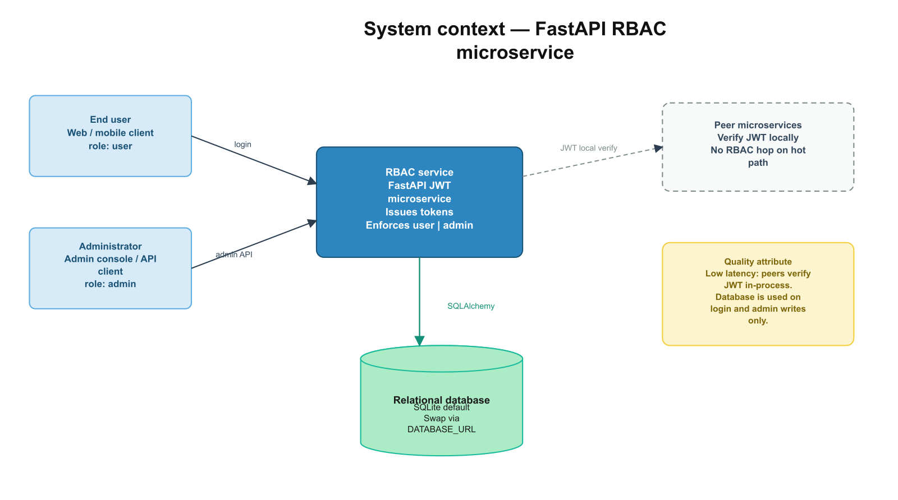
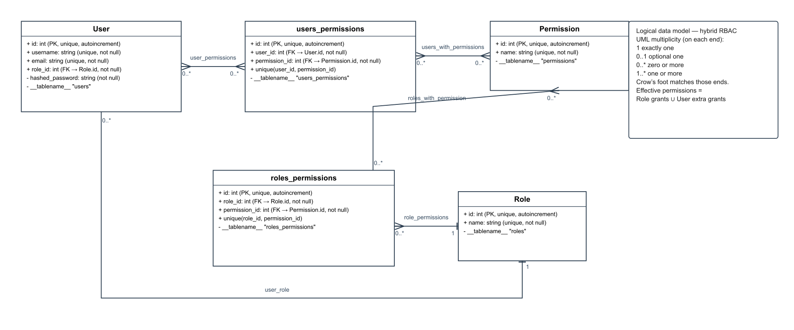
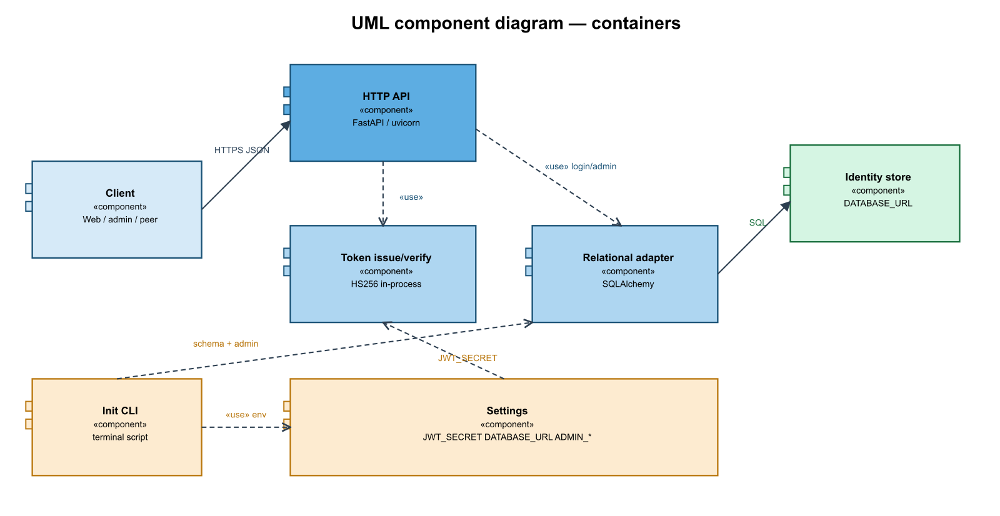
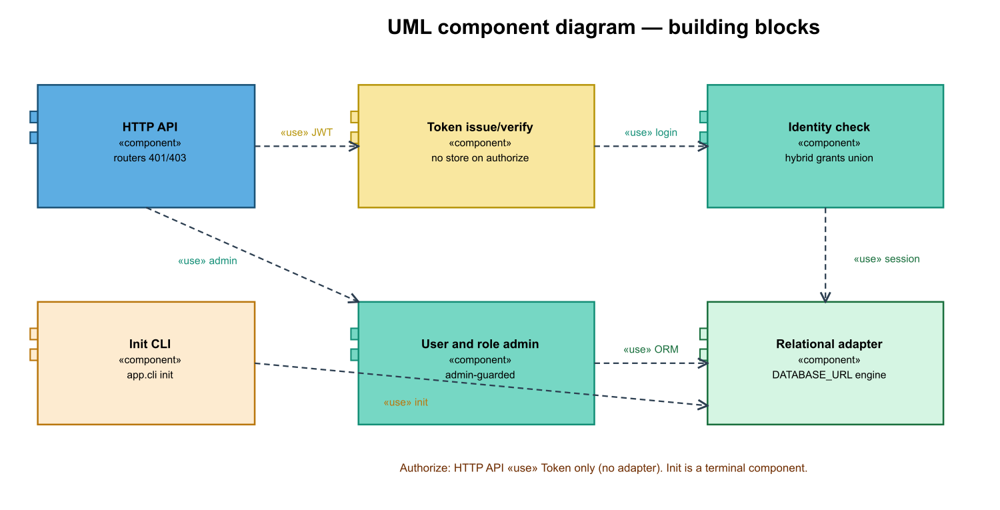
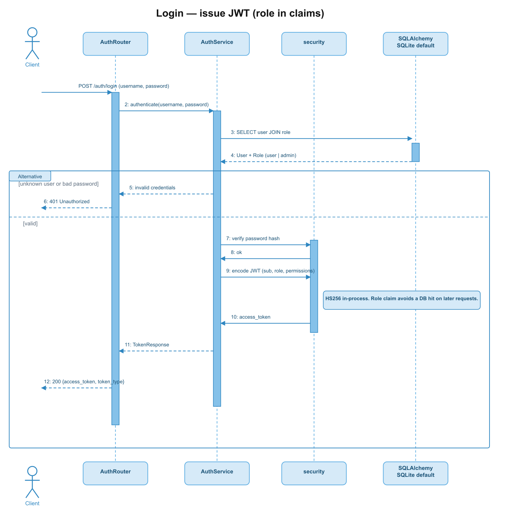
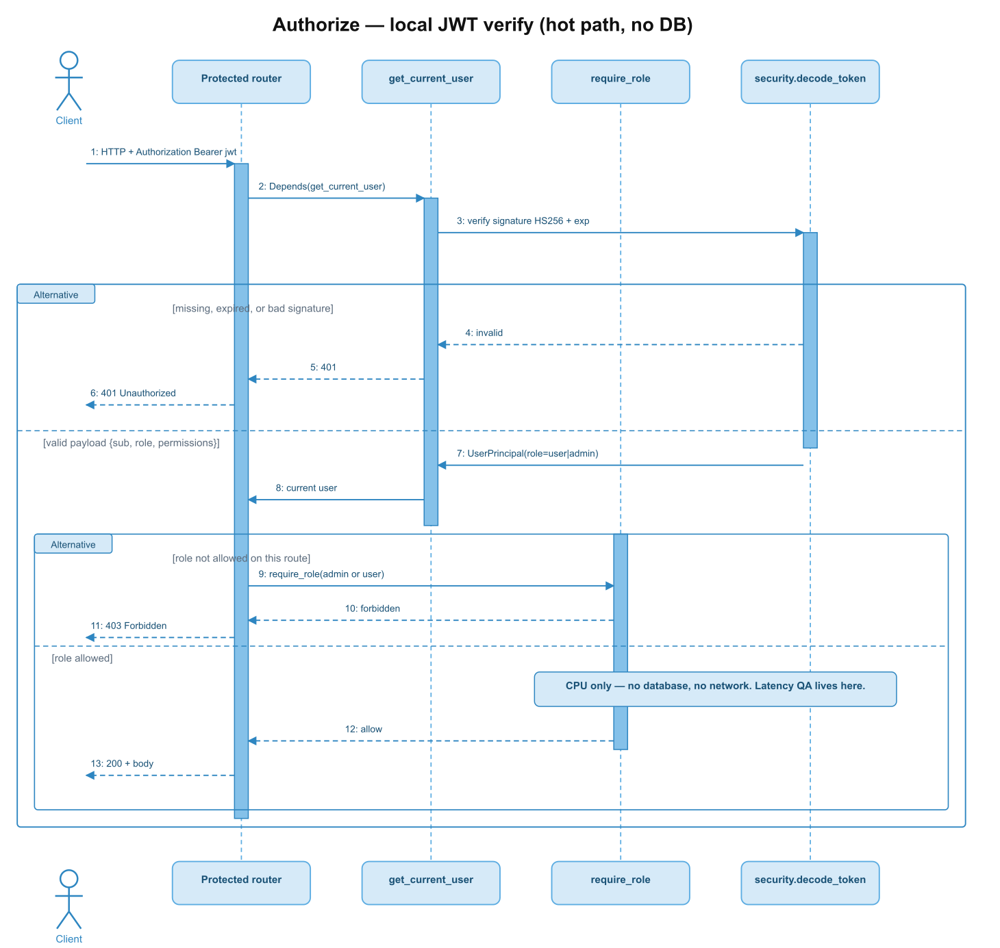
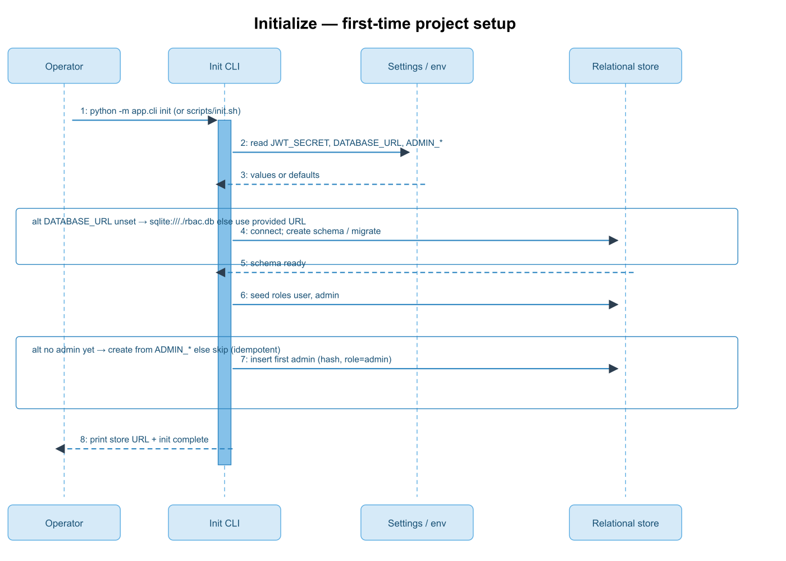
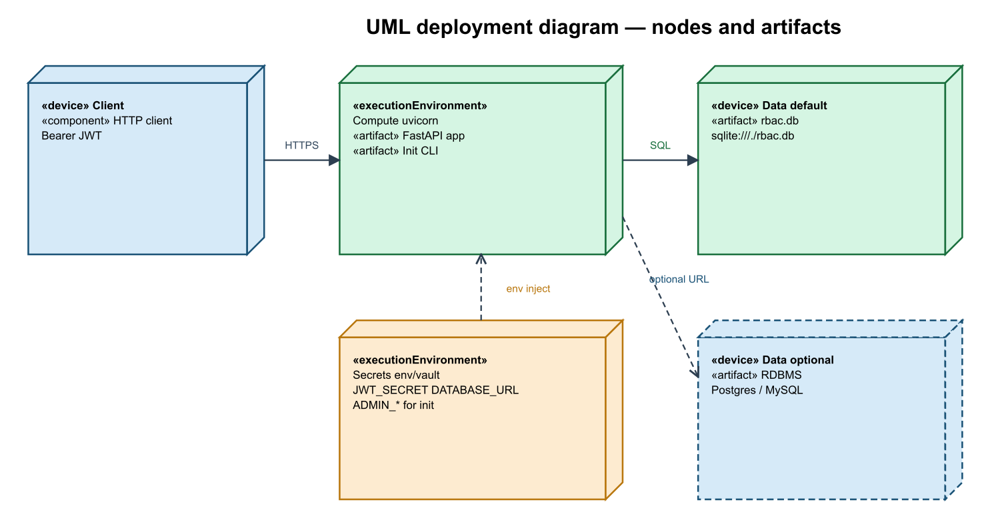

# Architecture vision

Problem, objectives, risks, constraints, effort, and architecture views (context, domain, components, deployment) for fastapi_rbac.

| Field | Value |
| --- | --- |
| Product | fastapi_rbac |
| Team | John Guerrero (solo) |
| Version | 0.1 |
| Date | 2026-09-15 |
| Cycle | 4 phases, 6 weeks, 240 h |
| Sources | Design kick-off (JWT **hybrid RBAC** service); Lucid UML component and deployment views; Lucid logical data model; login, authorize, and initialize sequences |

---

## Business problem to solve

Who needs this, what is broken today, and how the product removes that friction.

| Problem to solve |
| --- |
| Product and platform teams that expose HTTP APIs to end users and to other internal applications need a single place to prove identity and to decide whether the caller is an ordinary user or an administrator.  Today each API tends to copy its own login, password storage, and role checks. Rules drift (who is an admin on one API is not an admin on another), and some teams look up identity on **every** request, which adds delay and coupling. There is no shared, signed proof that another application can trust on its own.  This product registers people, checks credentials once at login, and issues a signed access token that already carries the role `user` or `admin`. Callers and other applications authorize from that token; they do not query this product or the identity store on the request hot path. |

---

## Stakeholder objectives

Measurable outcomes (what, by when). Not implementation patterns.

| Stakeholder objectives |
| --- |
| • **O1 (latency / authorize):** By the end of Construction (phase 3, hour 180), every protected request is allowed or denied using only the signed token — **0** identity-store round trips on the authorize path. • **O2 (role model):** By the end of Construction, an administrator can **CRUD all users** and assign **only** the roles `user` and `admin` (exactly **2** role names). A caller with role `user` can CRUD **only their own** record and cannot request other users. Deny uses HTTP status codes without leaking whether another user exists. • **O3 (peer trust):** By the end of Testing (phase 4, hour 240), another HTTP API that shares the signing secret can accept a token from this product and decide allow/deny with **0** extra calls back to this product. • **O4 (login):** By the end of Construction, a successful login performs **1** credential read against the identity store (user + role), then returns a token whose `sub` is the user id **and** a JSON `user_id` field with the same value. |

---

## Risks

Architectural failure modes. Each risk maps to a stakeholder objective or a named constraint.

| Identified risks |
| --- |
| • **R1 → O1:** If the token does not carry `role` (or verification is implemented as a store lookup), authorize reintroduces a database hop and O1 fails. • **R2 → O2:** If role names are free text or a third role can be inserted, the catalog is no longer `{user, admin}` and O2 fails. • **R3 → O3:** If peer applications must call this product on every request to learn the role, the extra hop violates O3 and the latency quality goal. • **R4 → O4:** If login fans out to several queries or to another identity product, the “one read then token” budget for O4 fails. • **R5 → technology constraint (secrets):** If the signing secret is baked into the image or committed to source, tokens can be forged and O1–O3 become unsafe. • **R6 → first-time setup:** If the product starts without a seeded catalog and a first admin, nobody can log in to create users (bootstrap deadlock). • **R7 → O2 (existence leak):** If a `user` receives 403 (or a distinct body) when requesting another `{id}`, the API discloses that the account exists. Object-level denials for other users must be **404**. |

---

## Business and technology constraints

A constraint **closes an alternative** (forbidden, mandated, or already chosen). Quality attributes (p95, auto-scale, RTO) are not constraints.

Low **request latency** is a quality attribute (authorize without a store hop). It is **not** listed here.

| Business constraints | Technology constraints |
| --- | --- |
| • Greenfield identity for this product: no mandate to integrate a corporate directory or social IdP (closes “must use an existing IdP first”). | • Backend already chosen: FastAPI (closes Flask, Django, or a non-Python HTTP stack). |
| • **Hybrid RBAC:** exactly two roles (`user`, `admin`), one role per user, plus optional extra permissions on the user (closes an open-ended role catalog, role-only RBAC, and permission-only ACL). | • Access proof already chosen: signed JWT, algorithm HS256 (closes cookie-session-only and asymmetric keys as the default). |
| • Solo delivery in a **240 h / 6 week** cycle (closes a multi-squad, multi-quarter program). | • System of record: relational database only; **SQLite is the default**, switched with `DATABASE_URL` (closes document stores or Redis as the identity database). |
| • Passwords are never stored or returned in plaintext (closes a recoverable-password design). | • Secrets (`JWT_SECRET`, `DATABASE_URL`) are injected at process boot from the environment or a secret store, never baked into the image (closes committed secrets in the artifact). |

---

## Estimated effort

Phases, activities, owners, and hours. `hours/person × people = team total` per phase.

**Cycle:** 6 weeks, 4 phases, 1 person. Arithmetic: `60 h/person × 1 person = 60 h` team total per phase; grand total `4 × 60 = 240 h`.

| Duration | Phase | Activities | Owners | Hours / person | Team total hours |
| --- | --- | --- | --- | --- | --- |
| 1.5 weeks | Analysis | • Confirm actors, use cases, and out of scope • Freeze **hybrid RBAC** (one role per user + optional extra grants) and role catalog (`user`, `admin`) • Draft requirements IDs and **Given/When/Then AC** (oracles for TDD; not Gherkin files) | John Guerrero | 60 | 60 |
| 1.5 weeks | Architecture design | • Context, domain, component, and deployment views • Token claims and authorize-without-store decision • `DATABASE_URL` portability and secret injection • pytest fixtures / query-counter design for TDD | John Guerrero | 60 | 60 |
| 1.5 weeks | Construction | • **TDD per AC:** red pytest → minimum code → refactor (`FR-31`) • Login (`user_id` + JWT `sub`), token issue/verify, self vs all-users CRUD, hybrid grants, health • Init CLI (schema, seed roles, default permission catalog, first admin, DATABASE_URL) • SQLite default schema and env-based settings | John Guerrero | 60 | 60 |
| 1.5 weeks | Testing | • Regression of the TDD suite; close HTTP matrix gaps • Authorize path: no store access • Login path: one credential read; `user_id` in 200 body = JWT `sub` • Init CLI + swap `DATABASE_URL` smoke check | John Guerrero | 60 | 60 |
| **Total (6 weeks)** | | | | **240** | **240** |

---

## Context model

Who uses the system, **over which channel**, and what stays **outside** the product boundary. Interior capabilities (router, hashing, session factories) stay inside and are not drawn here.

| | |
| --- | --- |
| **Project** | fastapi_rbac |
| **ID** | VC-001 |
| **Authors** | John Guerrero |
| **Version** | 1.0 |
| **View** | Context |
| **Model** | Context (UML use cases) |

This view must make evident: actors × channels × external systems. The product boundary is the RBAC HTTP service. Routers, password hashing, and session factories stay **inside** and are not drawn here.

| Actor | Channel | Use |
| --- | --- | --- |
| End user | HTTPS JSON | Log in (receives `user_id`); CRUD **own** user record only; cannot request other users |
| Administrator | HTTPS JSON | Log in as `admin`; **CRUD all users**; assign `user` or `admin`; list roles |
| Operator | Terminal (init CLI) | First-time setup: connection URL, schema, seed roles, first admin account |
| Peer application | Local token verification (shared signing secret); HTTPS JSON only when it calls this product’s login or admin APIs | Trust tokens issued here without a round trip on its own hot path |

| External system | Relationship |
| --- | --- |
| Relational identity store (SQLite file by default; other SQL databases via URL) | Persistence of users, roles, and grants; used at login and at admin writes, not at authorize |

Source: [Lucidchart — Architecture, page 1 System context](https://lucid.app/lucidchart/ce9220eb-71a9-462a-b15e-343d00728c1f/edit)

---

## Domain model

Business entities and relationships, not a physical ER or cloud schema. Optional data owner = who updates the entity.

| | |
| --- | --- |
| **Project** | fastapi_rbac |
| **ID** | VD-001 |
| **Authors** | John Guerrero |
| **Version** | 1.0 |
| **View** | Domain |
| **Model** | Domain |

This product uses **hybrid RBAC** (not role-only RBAC and not a standalone ACL):

| Layer | Rule |
| --- | --- |
| Role (RBAC) | Each **User** has exactly **one** **Role**: `user` or `admin`. The role is the coarse gate on admin vs user routes. |
| Role grants | A **Role** may grant many **Permissions** (defaults for everyone with that role). |
| Default catalog | Seeded at init: `admin` → CRUD **all** users; `user` → CRUD **self** only (`users:*_self`). |
| Extra user grants | A **User** may hold extra **Permissions** that the role does not give. Extra grants do **not** create a third role. |
| Effective rights | Role grants ∪ extra user grants. Computed at **login**, copied into the JWT (`sub` = user id, `role`, `permissions`). Authorize uses that snapshot only. |
| HTTP deny | Fail closed with status codes only: 401 unauthenticated; 403 for disallowed **operations**; **404** when role `user` targets another user’s id (no existence leak). |

| Entity | Main relationship | Proposed owner |
| --- | --- | --- |
| User | Many users belong to one Role; a user may have extra Permissions | Administrator (CRUD any row); the subject user (CRUD own row except `role`) |
| Role | Catalog of exactly `user` and `admin`; many Permissions per role | Administrator / seed at install (names are not user-editable as free text) |
| Permission | Shared by roles and by extra user grants; default names seeded at init | Administrator / seed at install |
| Role grant | Role 1 — 0..* Permission | Administrator |
| Extra user grant | User 1 — 0..* Permission | Administrator |

Source: [Lucidchart — User RBAC logical data model](https://lucid.app/lucidchart/630829d8-5ce5-4bb5-b3f2-fffba2934f9d/edit) (cardinalities `1`, `0..*`; `User.role_id` → `Role`)

---

## Component model

Runtime capabilities and connectors — not a class diagram. No cache, broker, or API gateway; those were not chosen.

| | |
| --- | --- |
| **Project** | fastapi_rbac |
| **ID** | VF-001 |
| **Authors** | John Guerrero |
| **Version** | 1.0 |
| **View** | Functional |
| **Model** | UML components |

Runtime capabilities as **UML «component»** blocks and «use» dependencies. No cache, broker, or API gateway — the team did not choose those.

| Capability | Responsibility |
| --- | --- |
| HTTP API | Accept HTTPS JSON: login (`user_id` in 200), health, self profile, user admin, role listing; return **401 / 403 / 404** without leaking whether another user exists |
| Token issue and verify | Hash-check password at login; issue HS256 token with `sub` (user id), `role`, `permissions`; verify signature and expiry **in process** (connector to HTTP API only — no store) |
| Identity check | Load user + role + **hybrid grants** (role permissions ∪ extra user permissions) from the store for **login and admin writes only** |
| User and role administration | Admin: CRUD **all** users. Role `user`: CRUD **self** only. Assign `user`\|`admin`, list roles, attach grants — administrator |
| Relational adapter | Map domain entities to SQL; engine selected by `DATABASE_URL` (SQLite default) |
| Init CLI | Terminal script for first-time setup: resolve `DATABASE_URL`, create schema, seed `{user, admin}` and the **default permission catalog**, create the first administrator |

Connectors: Client → HTTP API → Token issue/verify (authorize). Client → HTTP API → Identity check / User and role admin → Relational adapter (login/admin). Operator → Init CLI → Relational adapter (not HTTPS). Secrets are configuration of Token issue/verify, Init CLI, and the adapter, not a separate runtime HTTP component.

Source: UML [containers](https://lucid.app/lucidchart/b7de0d28-4aff-4a3a-9d0b-d67e8c5bc42f/edit) and [building blocks](https://lucid.app/lucidchart/d9604080-5380-4a18-8964-eea7faf66d35/edit); sequences [Login](https://lucid.app/lucidchart/87ba0496-0121-4f25-98ee-4aeed23be2c3/edit), [Authorize](https://lucid.app/lucidchart/d14b5a42-15d0-42b1-945c-421a5acf8406/edit), [Initialize](https://lucid.app/lucidchart/a46d483a-59a2-4253-b960-03d78d24acb5/edit)

---

## Deployment model

Nodes and zones (clients, compute, data, secrets). A cloud vendor is named only if the team already chose one.

| | |
| --- | --- |
| **Project** | fastapi_rbac |
| **ID** | VA-001 |
| **Authors** | John Guerrero |
| **Version** | 1.0 |
| **View** | Allocation / Deployment |
| **Model** | UML deployment |

No cloud vendor is chosen. Nodes are UML «device» / «executionEnvironment» with deployed «artifact» / «component» items.

| Node / zone | What runs |
| --- | --- |
| «device» Client | Browser, admin tool, or peer application sending HTTPS + `Authorization: Bearer` |
| «executionEnvironment» Compute | `uvicorn` hosting the FastAPI app; Init CLI on the same host; token verify stays in-process |
| «device» Data (default) | SQLite file artifact (`./rbac.db` or path from URL) — colocated, no extra network hop for login |
| «device» Data (optional) | PostgreSQL or MySQL reached only when `DATABASE_URL` is changed (needed if several writers share state) |
| «executionEnvironment» Secrets | Environment or secret store at boot: `JWT_SECRET`, `JWT_ALGORITHM=HS256`, `ACCESS_TOKEN_EXPIRE_MINUTES`, `DATABASE_URL`, `ADMIN_*` (init only) |
| Operations | `GET /health` on the compute process; first-time setup via Init CLI on compute |

Source: [Lucidchart — UML deployment](https://lucid.app/lucidchart/2919245a-bdd6-4ee7-a45f-29d8c6008bab/edit)
